# Employee Management CI Demo


A **Java 17 + Maven** project that demonstrates a complete DevOps
continuous-integration workflow: building and testing a small Employee
Management Service, running it through a **Jenkins** declarative pipeline with
**parallel stages** and a **distributed build agent**, and analyzing code
quality with **SonarQube** quality gates.

This repository is the deliverable for a Jenkins capstone covering four
sub-projects, all implemented in a single consolidated pipeline:

| # | Capstone Project | Demonstrated By |
|---|------------------|-----------------|
| 1.1 | Jenkins Pipeline as Code (Jenkinsfile from SCM) | `Jenkinsfile` read from GitHub via *Pipeline script from SCM* |
| 1.2 | Parallel CI Pipeline | `Parallel Tests & Analysis` stage (Unit + Integration + Code Quality) |
| 1.3 | Master–Agent Distributed Build | `Package (on Agent)` stage runs on an SSH `java-agent` node |
| 1.4 | Jenkins + SonarQube Quality Gate | `SonarQube Analysis` + `Quality Gate` stages |

---

## Table of Contents

- [Project Overview](#project-overview)
- [Architecture](#architecture)
- [Technologies Used](#technologies-used)
- [GitHub Repository](#github-repository)
- [Getting Started](#getting-started)
- [Build Instructions](#build-instructions)
- [Run Instructions](#run-instructions)
- [Jenkins Pipeline Flow](#jenkins-pipeline-flow)
- [Capstone Project Deliverables](#capstone-project-deliverables)
  - [1.1 — Pipeline as Code](#11--pipeline-as-code)
  - [1.2 — Parallel CI Pipeline](#12--parallel-ci-pipeline)
  - [1.3 — Master–Agent Distributed Build](#13--masteragent-distributed-build)
  - [1.4 — SonarQube Quality Gate](#14--sonarqube-quality-gate)
- [Code Coverage & Build Artifact](#code-coverage--build-artifact)
- [Known Limitation — Quality Gate Webhook](#known-limitation--quality-gate-webhook)
- [SonarQube Integration](#sonarqube-integration)
- [Future Enhancements](#future-enhancements)
- [Quick Command Reference](#quick-command-reference)
- [License](#license)

---

## Project Overview

The application implements an in-memory **Employee Management Service**.
Each `Employee` has an `id`, `name`, `department`, and `salary`. The
`EmployeeService` exposes operations to add, remove, search, and list
employees, with input validation and SLF4J logging throughout.

The accompanying `App` class wires the service together and demonstrates a
realistic workflow: adding employees, listing them, searching by id, removing
an employee, and printing the final list.

---

## Architecture

```
+-------------------+
|       App         |   Application entry point / demo workflow
+---------+---------+
          |
          v
+-------------------+
|  EmployeeService  |   Business logic: add / remove / find / list
+---------+---------+
          |
          v
+-------------------+
|     Employee      |   Domain model (id, name, department, salary)
+-------------------+
```

| Layer            | Class               | Responsibility                                   |
|------------------|---------------------|--------------------------------------------------|
| Entry point      | `App`               | Bootstraps the service and runs the demo flow.   |
| Service          | `EmployeeService`   | CRUD-style operations, validation, logging.      |
| Domain model     | `Employee`          | Data carrier with `equals`/`hashCode`/`toString`.|

All classes live under the `com.demo.service` package.

---

## Technologies Used

- **Java 17**
- **Maven** (build automation)
- **JUnit 5 (Jupiter)** (unit testing)
- **JaCoCo** (code-coverage reporting)
- **PMD** (static code analysis in the pipeline)
- **SLF4J + slf4j-simple** (logging)
- **Jenkins** (declarative CI pipeline, parallel stages, distributed agent)
- **SonarQube** (static analysis & quality gate)
- **GitHub** (source control & repository management)

---

## GitHub Repository

The project is version-controlled on GitHub and the pipeline is read directly
from the repository, fulfilling the "pipeline as code" requirement.

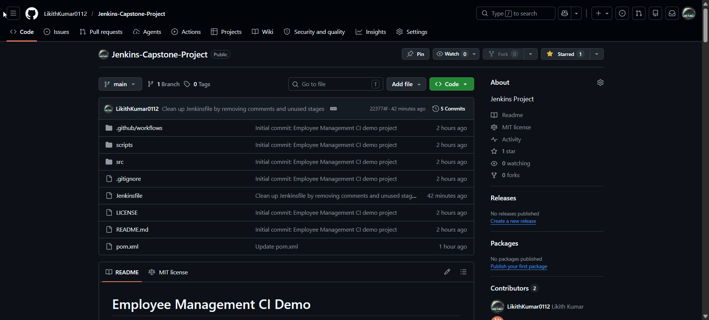

Commit history showing the iterative pipeline development:

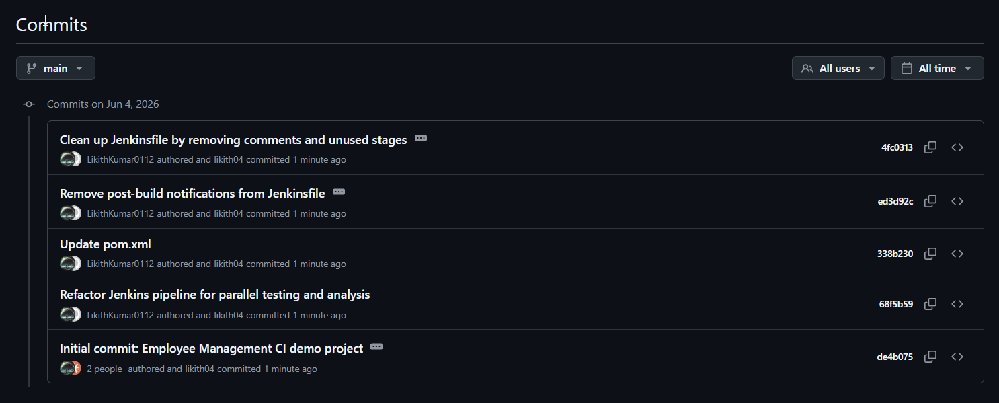

---

## Getting Started

Clone the repository and move into the project directory:

```bash
git clone https://github.com/LikithKumar0112/Jenkins-Capstone-Project.git
cd Jenkins-Capstone-Project
```

---

## Build Instructions

Prerequisites: **JDK 17** and **Maven 3.8+** on your `PATH`.

```bash
# Clean, run tests, and package
mvn clean test package

# Or use the helper script
./scripts/build.sh
```

The build produces a runnable jar at
`target/employee-management-ci-demo-1.0.0.jar`.

---

## Run Instructions

```bash
# Run the packaged application
java -jar target/employee-management-ci-demo-1.0.0.jar

# Or use the helper script (locates the jar automatically)
./scripts/run.sh
```

You can also run directly through Maven during development:

```bash
mvn compile exec:java -Dexec.mainClass=com.demo.service.App
```

---

## Jenkins Pipeline Flow

The `Jenkinsfile` defines a **declarative** pipeline. Build, test, and analysis
phases run on the controller, while packaging is delegated to a distributed
SSH agent labelled `java-agent`.

```
Checkout -> Clean -> Compile -> [ Unit Tests | Integration Tests | Code Quality ]  (parallel)
         -> Package (on java-agent) -> SonarQube Analysis -> Quality Gate -> Archive Artifacts
```

| Stage | What it does |
|-------|--------------|
| **Checkout** | `checkout scm` pulls the source from GitHub. |
| **Clean** | `mvn clean` removes previous build output. |
| **Compile** | `mvn compile` compiles the sources. |
| **Parallel Tests & Analysis** | Runs three stages concurrently: **Unit Tests** (`mvn test` + JUnit report), **Integration Tests** (`mvn verify`), **Code Quality Check** (`mvn pmd:check`). |
| **Package (on Agent)** | Runs on the `java-agent` node, packaging the jar on a distributed agent. |
| **SonarQube Analysis** | `mvn sonar:sonar` inside `withSonarQubeEnv` sends analysis to SonarQube. |
| **Quality Gate** | `waitForQualityGate()` evaluates the SonarQube gate result. |
| **Archive Artifacts** | Archives `target/*.jar` with fingerprinting. |

The pipeline expects Jenkins tool installations named `Maven3` (Maven) and
`JDK17` (JDK), and is triggered automatically on every push via
`triggers { githubPush() }` (requires the **GitHub** plugin and a webhook to
`<JENKINS_URL>/github-webhook/`).

The full **Stage View** of a successful run, including the test-result trend:

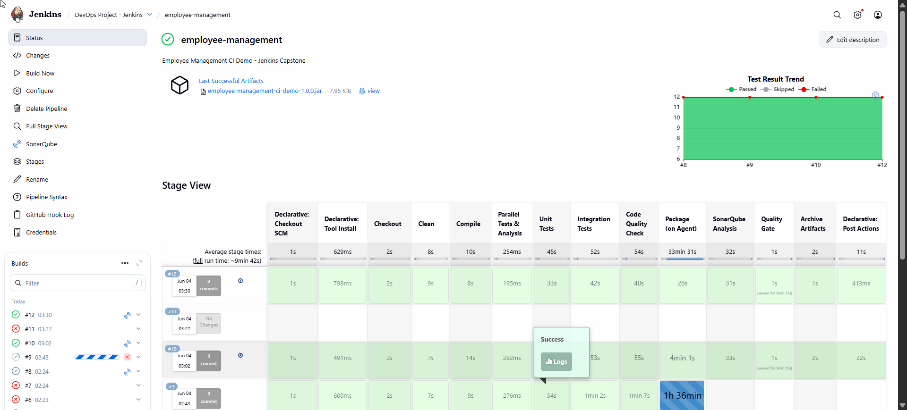

---

## Capstone Project Deliverables

### 1.1 — Pipeline as Code

The Jenkins job uses **Pipeline script from SCM**, so the entire pipeline lives
in the `Jenkinsfile` inside this GitHub repository — version-controlled and
reproducible.

Job configuration — General:

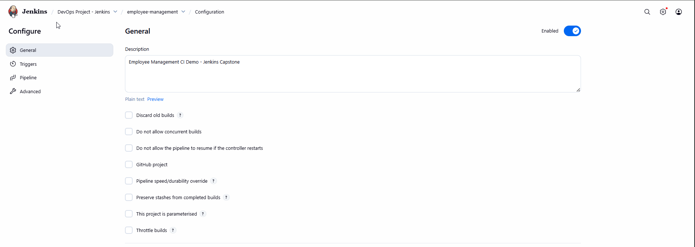

Pipeline definition pulling the `Jenkinsfile` from the Git repository:

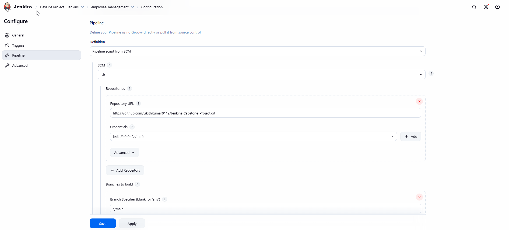

Branch specifier and `Script Path` set to `Jenkinsfile`:

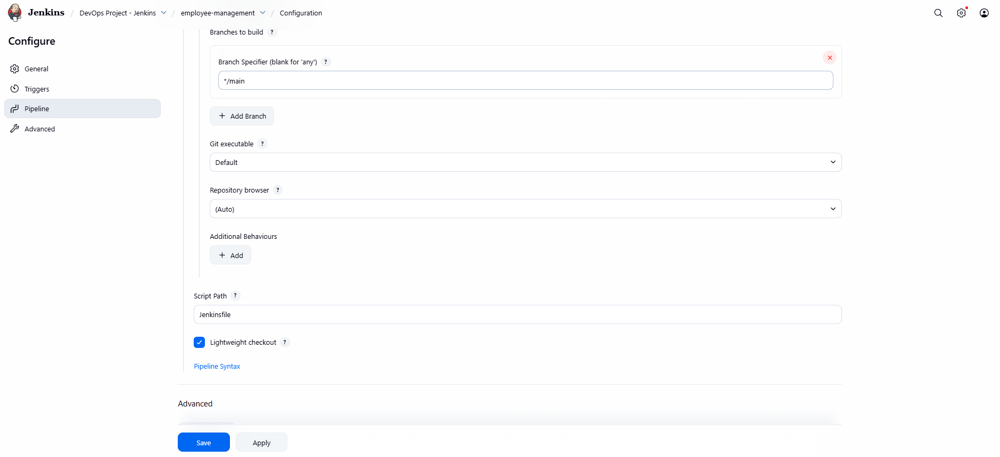

Console output of the Maven build executing from the checked-out pipeline:

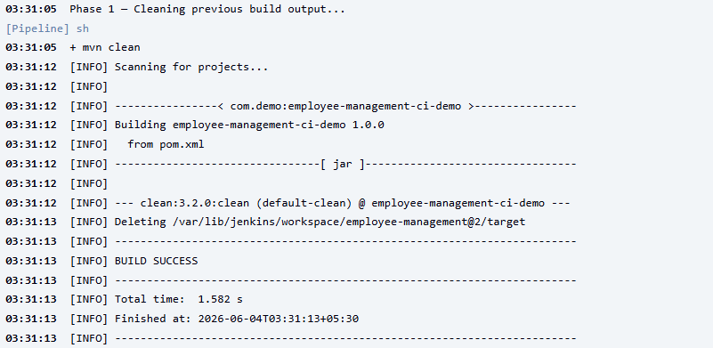

### 1.2 — Parallel CI Pipeline

The `Parallel Tests & Analysis` stage runs **Unit Tests**, **Integration
Tests**, and **Code Quality Check** simultaneously to reduce total build time.
The console log below shows all three branches starting at the **same
timestamp**, confirming concurrent execution:

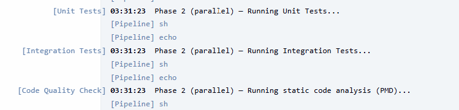

### 1.3 — Master–Agent Distributed Build

A separate Linux machine is connected to the Jenkins controller as an SSH agent
(`java-agent`). The `Package (on Agent)` stage is pinned to that node so the
packaging workload runs on a distributed agent instead of the controller.

Agent successfully connected and online:

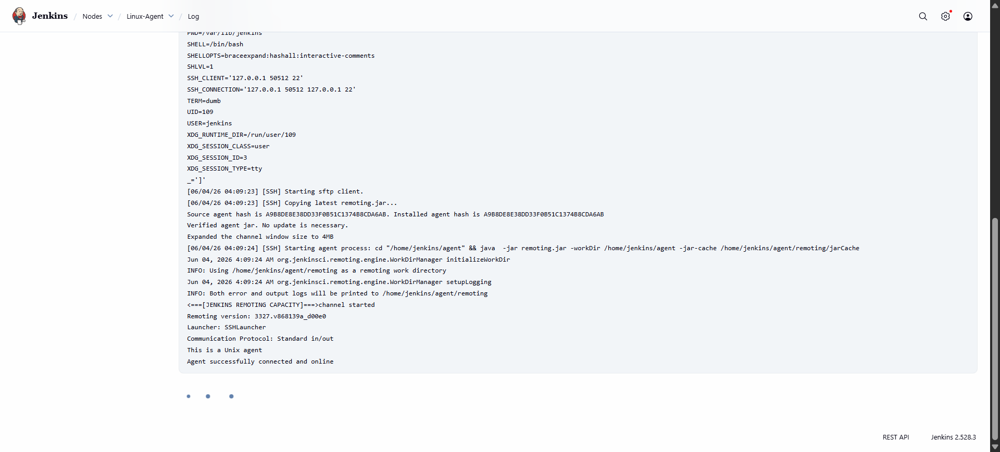

The `Package` stage executing on the remote agent (`Running on Linux-Agent`):

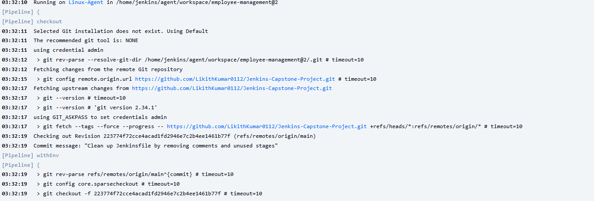

### 1.4 — SonarQube Quality Gate

After packaging, the pipeline runs `mvn sonar:sonar` against a SonarQube server
(hosted on an AWS instance) and evaluates the quality gate.

Quality Gate **Passed** on the SonarQube dashboard:

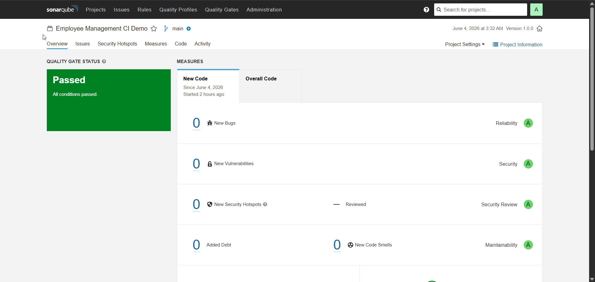

Issues view (0 bugs, 0 vulnerabilities, 1 code smell):

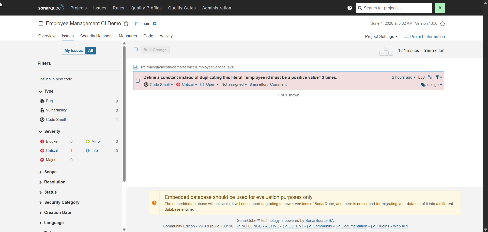

> See [Known Limitation — Quality Gate Webhook](#known-limitation--quality-gate-webhook)
> for why the in-pipeline `waitForQualityGate()` step does not auto-resume in
> this local-Jenkins / cloud-SonarQube setup.

---

## Code Coverage & Build Artifact

Code coverage is generated by the **JaCoCo** Maven plugin and fed into
SonarQube:

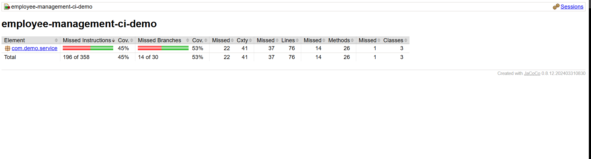

The pipeline produces and archives the runnable jar
`employee-management-ci-demo-1.0.0.jar`:

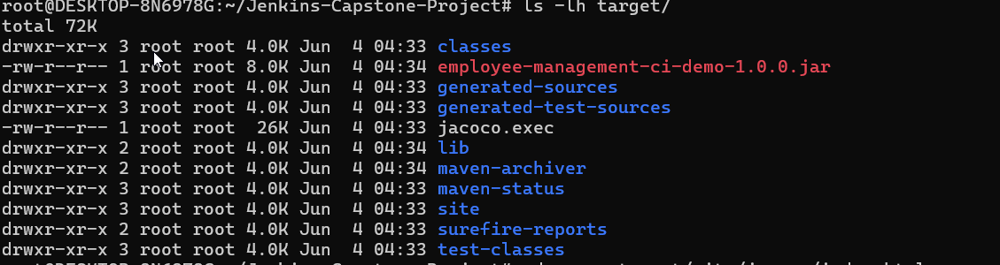

---

## Known Limitation — Quality Gate Webhook

In this environment **Jenkins runs locally** while **SonarQube runs on an AWS
instance**. The `waitForQualityGate()` step depends on SonarQube calling back
to Jenkins via a webhook (`<JENKINS_URL>/sonarqube-webhook/`). Because the local
Jenkins URL is not reachable from the AWS-hosted SonarQube server, that callback
could not be delivered, so the step waits until it times out (visible as the
"paused" time in the Stage View).

The analysis itself completes correctly and the gate **passes on the SonarQube
dashboard** (see [1.4](#14--sonarqube-quality-gate)); only the automatic
in-pipeline resume is affected. To make the gate block the build end-to-end,
expose the local Jenkins to SonarQube using one of:

- a public/reachable Jenkins URL or reverse proxy,
- a tunneling tool such as **ngrok** pointed at the Jenkins port, or
- running Jenkins and SonarQube within the same network/VPC.

Once SonarQube can reach the webhook, the `Quality Gate` stage will resume
immediately and fail the build on an `ERROR` gate status.

---

## SonarQube Integration

SonarQube properties are defined in `pom.xml`:

```xml
<sonar.projectKey>employee-management-ci-demo</sonar.projectKey>
<sonar.projectName>Employee Management CI Demo</sonar.projectName>
<sonar.java.source>17</sonar.java.source>
<sonar.coverage.jacoco.xmlReportPaths>${project.build.directory}/site/jacoco/jacoco.xml</sonar.coverage.jacoco.xmlReportPaths>
```

Run an analysis against your SonarQube server:

```bash
mvn clean verify sonar:sonar \
  -Dsonar.host.url=http://<SONARQUBE_HOST>:9000 \
  -Dsonar.login=<YOUR_SONAR_TOKEN>
```

In Jenkins, the analysis runs inside `withSonarQubeEnv('SonarQube')`, which
matches the server name configured under
*Manage Jenkins → System → SonarQube servers*.

---

## Future Enhancements

- Resolve the quality-gate webhook so the gate blocks the build automatically.
- Add real integration tests (Failsafe `*IT` classes) distinct from unit tests.
- Persist employees to a relational database (JPA / Spring Data).
- Expose a REST API with Spring Boot.
- Enforce a coverage threshold via the JaCoCo `check` goal.
- Containerize the application with Docker and deploy via Kubernetes.
- Configure a second agent (e.g. `python-agent`) to demonstrate multi-agent scheduling.

---

## Quick Command Reference

```bash
# Build
mvn clean test package

# Test only
mvn test

# Run
java -jar target/employee-management-ci-demo-1.0.0.jar

# SonarQube analysis
mvn clean verify sonar:sonar -Dsonar.host.url=http://<SONARQUBE_HOST>:9000 -Dsonar.login=<TOKEN>
```

---

## License

This project is released under the [MIT License](LICENSE). Feel free to use it
as a reference for your own DevOps portfolio.
